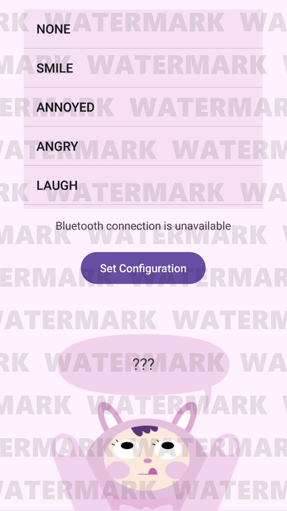

# Animatronic Doll

## Overview

This project demonstrates animatronic control using microcontrollers and a custom Android app. The physical frame of the animatronic doll is expected to be created separately and is not included in this repository. The codebase includes the code for the ESP32 and Arduino Nano that control an animatronic doll, and the code for an Android app that sends commands to operate the doll. Each piece of code is organized in the `code` folder.

## Face Display (ESP32)
This is the ESP32 code for controlling a TFT LCD (using SPFD5408 module) that displays facial expressions and for moving motors attached to the ears. You need to store expression images (BMP files) on the TFT LCD’s SD card under the following names:
- NONE.bmp
- SMILE.bmp
- ANNOYED.bmp
- ANGRY.bmp
- LAUGH.bmp
- SURPRISED.bmp
- SAD.bmp
- AFRAID.bmp
- SHY.bmp
- LOVE.bmp
- CRY.bmp
- QUESTION.bmp
- HELLO.bmp
- SLEEP.bmp
- THINK.bmp
- SHOCK.bmp

In the `loop()`, it receives commands from the Arduino Nano via Serial communication, following the format: `<left ear angle>,<right ear angle>,<expression>` (e.g. 90,90,NONE). Upon receiving a command, the device first shows a warm-up animation using a sequence of images, and then updates the ear angles and the facial expression on the display. The displayed image is loaded from the SD card, matching the expression name.
`warmupimage.h` file defines five images used for the warm-up animation as 16-bit RGB pixel data. If you need to convert an image file to RGB binary, I recommend using [LCD Image Converter](https://lcd-image-converter.riuson.com/en/about/). Loading images from the SD card for animation can cause noticeable delays, resulting in choppy transitions. To avoid this, the animation frames are stored directly in Arduino memory, allowing for faster and smoother display updates that create the appearance of fluid animation as shown below.

## Motor Control (Arduino)
This Arduino code receives commands (refer to the Mobile app Command Format) via Bluetooth and adjusts the angles of four motors — the neck, left arm, right arm, and waist — accordingly. At the same time, it edits the received command into a new format compatible with the ESP32 (refer to the ESP32 Command Format) and sends it over Serial communication.
When a dance command is received instead of an emotion, the operation does not end with a single motor angle adjustment. In this case, additional built-in movements need to be implemented. An example can be found in the `Perform_Normal_Dance()` function in the code.

## Mobile App (Android)
This repository includes the Android application code used to control the animatronic doll by sending commands via Bluetooth. When the app starts, it allows the user to connect to the Arduino embedded in the doll through Bluetooth and begin sending commands. On the initial screen, you can find a list for selecting emotions, a button for opening the configuration settings, and a speech bubble displaying the doll's currently expressed emotion.

By tapping the `Set Configuration` button, you can access a screen where you can configure the emotions and the corresponding motor angles. The configuration follows the format: `<emotion>,<left ear angle>,<right ear angle>,<neck angle>,<left arm angle>,<right arm angle>,<waist angle>` (e.g. NONE,90,90,90,90,90,90), and if an entry does not follow this format, the configuration cannot be saved. Once a setting is saved, future commands will be sent using the specified motor angles.

  
  

